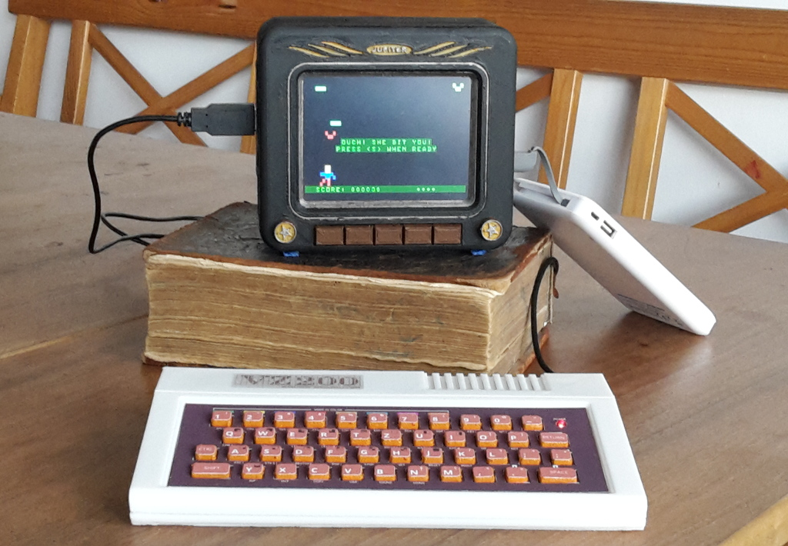

# VZ200
## Nachbau eines VZ200-Color-Computers (1983)

Mit einem funktionstüchtigen Nachbau des "VZ200 Color Computer" von 1983 lassen wir die Welt der 8-Bit Computer wieder auferstehen.

__Autoren:__ Jürgen Wahlmann & Christian Wahlmann

Dieses Repository dient der Verwaltung aller Sourcen, insbesondere
* 3d-Modelle (Fusion360)
* Platinenlayout (KiCad)
* Grafiken für Tastatur- und Logo-Aufkleber
* JemuVZ200-Emulator (Java-8 / Gradle)
* VZ200 Companion App (Angular)

Dokumentation und Releases sind gehostet unter https://cwahlmann.github.io/vz200-remake
