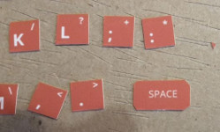

# vz200
Nachbau eines VZ200-Color-Computers (1983)


* [Design und Druck der Bauteile](#druck)
* [Platinendesign und -produktion](#platinendesign)
* [Zusammenbau des VZ200](#zusammenbau)
* [Zusammenbau des Monitors mit TFT-Display, Raspberry-Pi und Lautsprecher](#monitor)
* [Installation des Raspberry Pi](#installation)

# <a name="druck">Design und Druck der Bauteile</a>
## 3d-Modell
erstellt mit Autodesk Fusion (Startup-Lizenz nur für private Nutzung). Bei Aussparungen für Fußleisten oder andere Elemente, die eingepasst werden müssen bitte beachten, dass die Drucke meist mit ca. 0.1mm zusätzlicher Stärke gedruckt werden, damit die Schichten gut aneinander haften. Hinzu kommt, dass die erste Schicht zwecks besserer Haftung am Druckbett etwas plattgedrückt wird. Entsprechende Toleranzen bitte mit einplanen.

**Bitte beachten**: Das Modell des Computergehäuses und die darin verbaute Elektronik sind dafür 70% der Originalgröße ausgelegt. Die STL-Dateien geben das bereits wieder; in den Fusion-Dateien (.3mf) hat das Gehäuse noch die Originalgröße. Wer das Modell in Originalgröße nachbauen möchte, muss die Pfosten für den Tastaturcontroller anpassen und die Tastaturplatine entsprechend skalieren, bevor sie geätzt wird. Außerdem muss gegebenenfalls die Position der Resetschalter-Halterung angepasst werden.


## Drucke
STL-Dateien aus Fusion werden mit Ultimaker Cura 4.1 druckfertig gemacht -> gcode für Creality Ender 3.
Typische Auflösung: x/y 0.4mm (abhängig von der Düse), z 0.05-3mm (Schrittmotor, Extrusion)
Düsen von 0.2, 0.3, 0.5 und 0.6 stehen auch zur Verfügung, wobei die Gefahr der Verstopfung mit kleineren Durchmessern steigt. Holz besser mit 0.5 oder 0.6 drucken.

Wichtige Druckparameter: Wandstärke, Füllung (Stärke, Muster), Geschwindigkeit, Schichtendicke und abhängig vom Filament Düsen- und Betttemperatur sowie ggf. Anpassungen an der Fließgeschwindigkeit.

Gedruckt wird mit PLA (Gehäuse) und TPU-Filament (Tastatur). 

PLA entspricht hartem Plastik, bis ca. 60 Grad Celsius verformungssteif, danach wird es weich. Große Auswahl an Farben. 

TPU ist ein flexibles Filament, das sich gut für Handyhüllen oder Gummitastaturen eignet. Die Farbauswahl ist jedoch sehr beschränkt, so dass wir das karamellbraun der Originaltasten nicht direkt drucken können. Aktuell verfügbar sind ein mitteldunkles Blau und weiß.

Für den VZ 200 nehmen wir Weiß (Gehäuse), schokoladenbraun (Tastaturabdeckung) und holzbraun für die Tastatur (holzartig) oder eben weiß (gummiartig).

Auch möglich ist PET-G, eine Abwandlung des in der Industrie üblichen PET mit denselben Eigenschaften. Liegt aktuell nur in HellGrau vor.

Sonder-Filamente sind möglich (schwach leitend, fluoreszierend, transparent).

Hinweis: Löten auf den schwach leitenden Filamenten ist nicht möglich.

# <a name="platinendesign">Platinendesign und -produktion</a>

eigenes Platinenlayout mit Dip-Schaltern (6mm; Höhe über Platine: 4,5mm; 4 Füße), die über eine Gummi-Tastaturmappe betätigt werden.
Tastaturcontroller: KEYWARRIOR24_8_MODUL_KW24_8_MOD

Das Layout kann, als Zip mit GBR-Dateien, über diverse Anbieter in kleiner Stückzahl (meist >= 3) produziert werden. 

Gute Erfahrungen habe ich gemacht mit [Aisler](https://aisler.net). 


# <a name="zusammenbau">Zusammenbau des VZ200</a>

Das Chassis beherbergt eine funktionierende Tastatur mit Power-LED und Reset-Taster.

Bei einer Größe von 70 Prozent gegenüber dem Original-Rechner passt der Raspberry Pi nicht mit ins Gehäuse. Dieser wird deshalb in
den Monitor integriert. Der VZ200 wird als USB-Tastatur an den Raspberry angeschlossen. 

(Ein Raspberry-Zero würde in das Gehäuse passen, es muss jedoch getestet werden, ob dieser für den Emulator genügend Rechenpower liefert.)

## benötigte Bauelemente

| Bauteil | Beschreibung |
| ------- | ------------ |
| Gedruckte Teile | Boden, Abdeckung hinten, Tastatur (Rahmen, Schablone, Tastenmatte), Resetschalter + Klammer |
| Gedrucktes Logo | auf Transparenter selbstklebender Folie gedruckt |
| Gedruckte Tasten | auf selbstklebenem weißem Papier gedruckt |
| Gedruckte Tastaturschablone | auf selbstklebenem weißem Papier gedruckt |
| Tastaturplatine | mit Hilfe des Platinendesigns kann die Platine über diverse Anbieter gefertigt werden |
| Tastaturcontroller | ein USB-Keyboard-Controller mit vordefinierter Belegung: KEYWARRIOR24_8_MODUL_KW24_8_MOD |
| USB-Kabel | USB-Kabel mit Stecker und Litzen zum Einlöten |
| 45 Drucktaster | Bestückung der Tastaturplatine, 6x6 mm |
| 1 rote LED | die Power-LED, 3mm |
| 1 Widerstand | 150 Ohm (braun / grün / braun) |
| ein Stück Lochplatine | für den Drucktaster des Resetschalters, Lochabstand 2.56 mm |
| 1 Drucktaster | für den Resetschalter, 6x6 mm |
| Rot-Weiße Litze | für den Resetschalter und die Power-LED |
| 8-adriges Flachbandkabel | z.B. aus alten IDE-Flachbandkabeln, für die Verbindung Tastaturcontroler -> Tastaturplating |
| ein Stück Isolierband | Abschirmung von Reset-Schalter und Tastaturplatine | 
| 7 kurze Schrauben | Befestigung von Tastaturplatine und -Controller |
| 2 kurze Schrauben | Befestigung der Reset-Schalter-Platine |
| 2 kurze und 2 lange Schrauben | Zusammenbau des Gehäuses |

## hintere Gehäuseabdeckung mit Logo versehen


Das gedruckt Logo muss wir abgebildet auf der hinteren Gehäuseabdeckung angebracht werden.


## Tastatur zusammenbauen
Benötigt werden die gedruckte Tastaturmatte und die gedruckten Tastenaufkleber.
Die Matte muss mit Sprühlack Matt-Orange besprüht werden.


Die Aufkleber werden nun geschnitten.


Wichtig ist: damit die Tasten einen runden Eindruck machen, sollten die Ecken der Aufkleber diagonal angeschnitten werden.





Die geschnittenen Aufkleber werden auf die Tastaturmatte geklebt.


Nun wird die Tastaturschablone vorbereitet. Dazu wird die gedruckte Schablone und der gedruckte Aufkleber benötigt.


Die Aussparungen für die Tasten und die Power-LED werden mit dem Cutter herausgetrennt.


Dann wird der Aufkleber auf die Schablone geklebt. Wichtig ist, dass die Aussparungen mittig auf die der Schablone geklebt werden. Dabei bleibt ein kleiner Rand, damit sich die Tasten nicht am Aufkleber verhaken.


Nun wird die Tastenmatte von hinten in die Schablone gesteckt, und die Schablone in den Tastaturrahmen eingehakt.


## Verlöten und Einbau der Elektronik

Im Bild eine Übersicht der benötigten Einzelteile:


Der Resettaster wird auf die zugeschnittene Lochplatine gesteckt.


 Mit der Rot-weißen Litze wird der Taster mit der Tastaturplatine verbunden.


Dann werden noch zwei der kurzen Schrauben in die Platine geschraubt, zur späteren Befestigung am Boden des Gehäuses.


Das USB-Kabel wird wie abgebildet mit dem Tastaturcontroller verbunden.
**Achtung:** Das Kabel muss vor dem Löten durch das Loch des Gehäuseunterteils geführt und einfach verknotet werden!

| USB-Kabel Litzenfarbe | Controller Anschluss | 
| --------------------- | -------------------- |
| Rot | +5V |
| Weiß | D- |
| Grün | D+ |
| Schwarz | GND |

An +5V und GND wird zusätzlich die zweite Rot-Weiße Litze für die Power-LED angelötet:

| Power-LED Litzenfarbe | Controller Anschluss | 
| --------------------- | -------------------- |
| Rot | +5V |
| Weiß | GND |


Nun werden die grauen Flachbandkabel an den Controller gelötet, an die Anschlüsse X0-X7 und Y0-Y7:


Jetzt wird die Tastaturplatine mit Tastern, der Power-LED und dem Vorwiderstand für die LED bestückt:


Der Plus-Pol der LED (langes Bein) muss in den quadratischen Lötkontakt der Platine gelötet.


Die Ausrichtung der Taster ergibt sich aus den Abständen der Lötkontakte auf der Platine.


Nun wird die Rot-weiße Litze, welche an +5V / GND des Tastaturcontrollers angelötet ist, an die Tastaturplatine angelötet. Der weißumrandete Lötkontakt ist Minus (weiße Litze), der quadratische Kontakt ist Plus (rote Litze).
Danach werden die beiden Flachbandkabel an die Tastaturplatine gelötet. Hier ist sehr auf die Ausrichtung zu achten, die Lötkontakte der Tastaturplatine sind mit x0-x7 und y0-y7 beschriftet.


Nun wird der Reset-Taster ins Gehäuse eingebaut. Zunächst wird der gedruckte Reset-Schalter in das Gehäuse geschoben und mit der Klammer gesichert.


Dann wird die Platine mit dem Drucktaster aufgesetzt.


Nun wird der Tastaturcontroller mit drei kurzen Schrauben in das Gehäuse geschraubt.


Auf den Reset-Taster wird etwas Isolierband geklebt, damit die Schraube unter der Tastaturplatine keinen Kurzschluss verursachen kann.


Die Platine wird mit vier kurzen Schrauben im Gehäuse befestigt.


Zuletzt werden der Tastaturrahmen und das hintere Gehäuseteil aufgesetzt und auf der Rückseite mit zwei langen und zwei kurzen Schrauben befestigt.


Damit ist der VZ200 fertig. Der Emulator "JEmu" kann übrigens sowohl auf einem Raspberry PI als auch auf einem PC betrieben werden. Der VZ200 fungiert dabei als USB-Tastatur.

# <a name="monitor">Zusammenbau des Monitors mit TFT-Display, Raspberry-Pi und Lautsprecher</a>

## benötigte Bauelemente

| Bauteil | Beschreibung |
| ------- | ------------ |
| Gedruckte Teile | Vorderseite, Front, Rückseite, Befestigungsring für Lautsprecher, 4 Gummifüße |
| Audio-Verstärker | ... |
| 3,5er Stereo Klinkenstecker | gerne gebraucht, da dieser sowieso "entkernt" werden muss |
| Lautsprecher | 4 Ohm, ... Watt |
| Raspberry Pi | Modell >= 3b |
| TFT-Display | JOY-iT 5“ HDMI Touchscreen Display |
| 4 Schrauben | Befestigung des Lautsprechers im Gehäuse |
| 4 Schrauben | Verschrauben des Gehäuses |
| 4 Schrauben | Befestigung des Displays

## TODO

# <a name="installation">Installation des Raspberry Pi</a>

Projekt bauen mit Gradle:
```
gradle createVZ200Zip
```
Es entsteht ein Zip mit allen benötigten Dateien unter `build\distributions\JemuVZ200.zip`

Installieren der Desktop-Version des Betriebssystems Raspbian: siehe Raspbian-Dokumentation unter www.raspbian.org
(Raspbian Buster Desktop Lite)


Zip ins Home-Verzeichnis des Raspberry kopieren und entpacken.
Danach sollte folgende Verzeichnisstruktur entstanden sein:

```
pi@raspberrypi:~ $ unzip JemuVZ200.zip
Archive:  JemuVZ200.zip
   creating: vz200/
   creating: vz200/system/
   creating: vz200/system/vz/
   creating: vz200/system/vz/rom/
  inflating: vz200/system/vz/rom/VZ.CHR
  inflating: vz200/system/vz/rom/VZBAS12.ROM
  inflating: vz200/system/vz/rom/README.txt
   creating: vz200/tape/
  inflating: vz200/tape/README.txt
   creating: vz200/tape/default/
  inflating: vz200/tape/default/README.txt
   creating: vz200/vz/
  inflating: vz200/vz/README.txt
  inflating: vz200/vz200-all.jar
  inflating: desktop-wallpaper.png
  inflating: vz200.desktop
  inflating: vz200.sh
```

`dos2unix` installieren:
```
sudo apt-get install dos2unix
```

Zeilenumbrüche nach Unix konvertieren:
```
dos2unix vz200.desktop
dos2unix vz200.sh
```

Das Start-Skript `vz200.sh` ausführbar machen:
```
chmod +x vz200.sh
```

Die Datei `vz200.desktop` in den Autostart-Ordner kopieren:

```
mkdir ~/.config/autostart
cp vz200.desktop ~/.config/autostart
```
Installieren der OpenJDK-8 Runtime und des ALSA-Treibers mit `apt-get`:
```
sudo apt-get install openjdk-8-jre
sudo apt-get install alsa-base alsa-utils
```
Die Java-Sound-Konfiguration anpassen (PulseAudio auskommentieren, DirectAudioDevice einkommentieren):
```
sudo joe /etc/java-8-openjdk/sound.properties
#javax.sound.sampled.Clip=org.classpath.icedtea.pulseaudio.PulseAudioMixerProvider`
#javax.sound.sampled.Port=org.classpath.icedtea.pulseaudio.PulseAudioMixerProvider
#javax.sound.sampled.SourceDataLine=org.classpath.icedtea.pulseaudio.PulseAudioMixerProvider
#javax.sound.sampled.TargetDataLine=org.classpath.icedtea.pulseaudio.PulseAudioMixerProvider

javax.sound.sampled.Clip=com.sun.media.sound.DirectAudioDeviceProvider
javax.sound.sampled.Port=com.sun.media.sound.PortMixerProvider
javax.sound.sampled.SourceDataLine=com.sun.media.sound.DirectAudioDeviceProvider
javax.sound.sampled.TargetDataLine=com.sun.media.sound.DirectAudioDeviceProvider
```
Editor verlassen mit STRG-K und X.
   
Raspi-Configuration starten und folgende Einstellungen vornehmen:
- Umstellen audio auf headphone
- Splash-Screen unterdrücken
```
sudo raspi-config
```

Lautstärke auf Maximum stellen:
```
amixer sset 'Master' 65536
```
Taskleiste ausblenden: Rechtsklick auf Taskleite - Leisteneinstellungen - Erweitert: Leiste bei Nichtbenutzung minimieren + Größe bei minimiertem Zustand: 0 Pixel

HDMI-Settings in /boot/config.txt anpassen: `disable-overscan=1`, `hdmi_group=1`, `hdmi_mode=3`

Zum Schluss Desktop-Umgebung das Hintergrundbild `desktop-wallpaper.png" einstellen.

Nach einem Reboot sollte der Emulator im Vollbildmodus starten.

# VZ200-Emulator Jemu

Der genutzte Emulator ist eine angepasste Version des Java-Emulators 'jemu': http://jemu.winape.net/

## Port Konfiguration

application.properties (Default 8080):

```
server.port = 10101
```

Reset-Taste: [ESC]

## Erweiterung laden / speichern von .vz:

```basic
OUT 252,1
READY
```

PORT | IN / OUT | Beschreibung
-----|----------|-------------
252  | OUT      | LOAD .vz program no. [n]
253  | OUT      | SAVE .vz program no. [n]

Alle Programme n <= 100 sind readonly.

(werden in [home]/vz200/vz abgelegt)

## Erweiterung Tape-Controle

```basic
PRINT INP(254)
10
READY
```

PORT | IN / OUT | Beschreibung
-----|----------|-------------
254  | OUT      | 0: STOP, 1: PLAY, 16: RECORD
255  | OUT      | REWIND to position [n]
254, 255  | IN  | get LSB / MSB of tape position

(werden in [home]/vz200/tape abgelegt)

## Erweiterung Volume-Controle

ADRESS | R / W | Beschreibung
-------|-------|-------------
0x6fff / 28671 | W | Setzt die Lautstärke (0-127)

## REST-Interface

```bash
curl -X POST http://localhost:8080/vz200/vz 
     -H "Content-Type:application/octet-stream" 
     --data-binary @/D/Downloads/8bit/vz200/jvz_021/vz_files/games_autostart/CRASH.vz
```
Basis-Pfad: [HOST]:[PORT]/vz200

Endpunkt | Method | Request | Response | Beschreibung
---------|--------|---------|----------|-------------
/        | GET    |         | String   | Info
/reset   | POST   |         | String   | Reset Computer
/vz      | POST   | application/octet-stream | String | .vz-Programm einspielen
/vz[?autorun={True/False}][&range={start-end}]      | GET    |         | application/octet-stream | .vz-Programm auslesen; autorun: mit Autostart-Flag speichern; range: Speicherbereich (default: Basic-Pointer)
/bas     | POST   | application/octet-stream | String | Basic-Programm-Source einspielen
/asm[?autorun={True/False}]     | POST   | application/octet-stream | Range: {von-bis} | Assembler-Programm-Source einspielen und ggf. starten (default True)
/asm/{von[-bis]} | GET    | | String | Speicherbereich als Maschinenprogramm auslesen
/hex     | POST   | application/octet-stream | String | Hexadezimalen Source einspielen und starten
/hex/{von[-bis]} | GET    | | String | Speicherbereich in hexadezimalem Format auslesen
/printer/flush | GET | | String | zuletzt gedruckte Zeilen auslesen
/tape    | GET    |         | String | Namen des eingelegten Tapes lesen
/tape/{name} | POST    |        | String | Type mit angegebenem Namen einlegen
/tape/slot | GET    |         | Integer | aktuellen Slot des Tapes lesen
/tape/slot/{id} | GET    | Integer | | Tape zu angegebenem Slot spulen
/tape/play | POST | | Integer | Tape starten; gibt Slot zurück
/tape/record | POST | | Integer | Aufnahme starten; gibt Slot zurück
/tape/stop | POST | | Integer | Tape stoppen; gibt Slot zurück
/sound/{volume} | POST | Integer | | Audio-Lautstärke von 0 (=Stumm) bis 255 (=+6 DB)

# Nützliche Links

Raspi-Emulator für Windows (leider schon 7 Jahre alt)
https://sourceforge.net/projects/rpiqemuwindows/

# Screenshots


